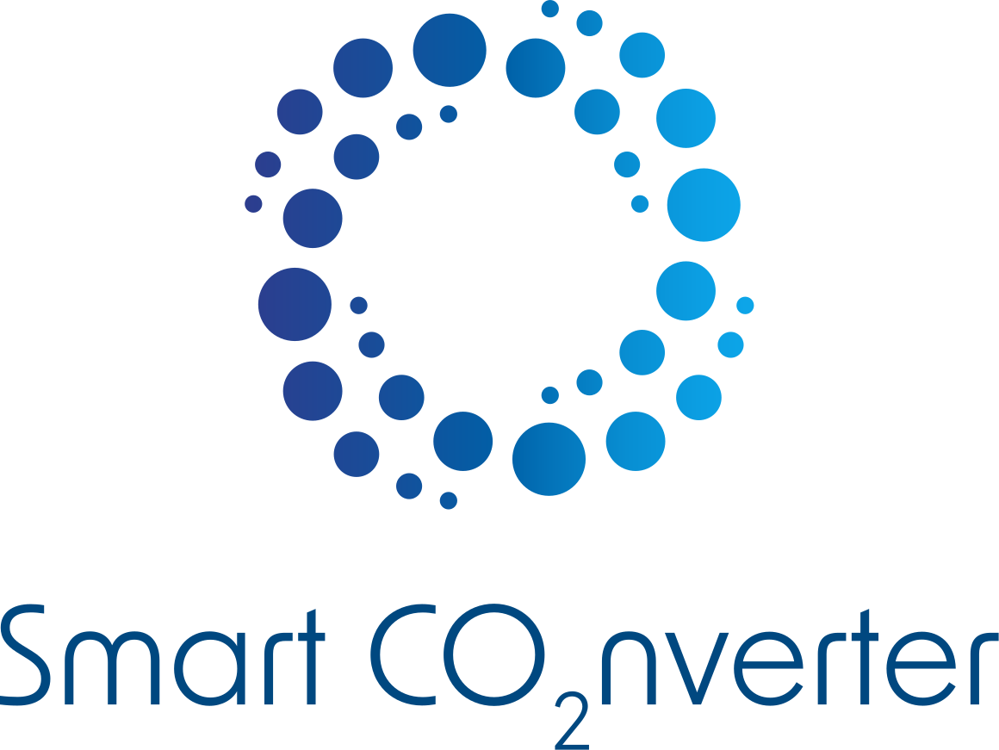
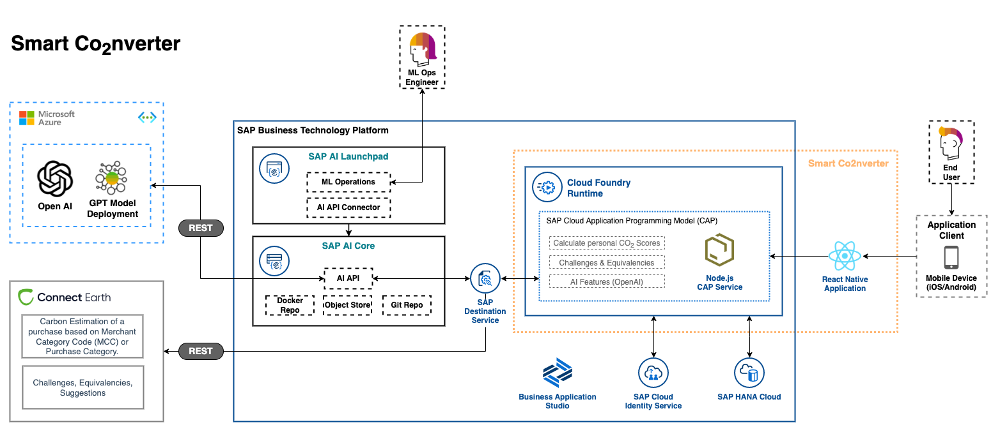
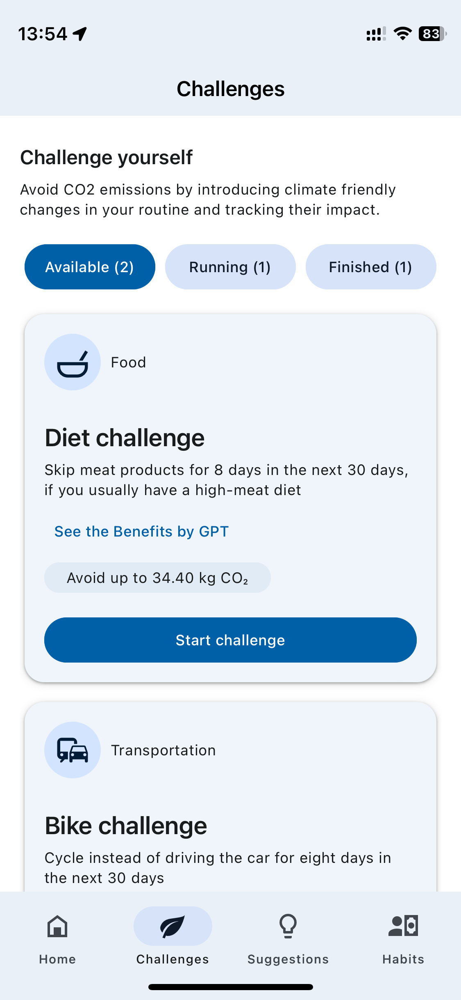
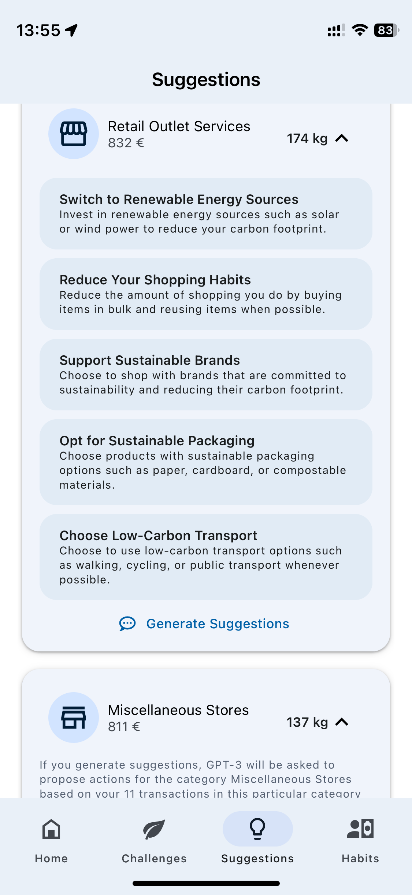
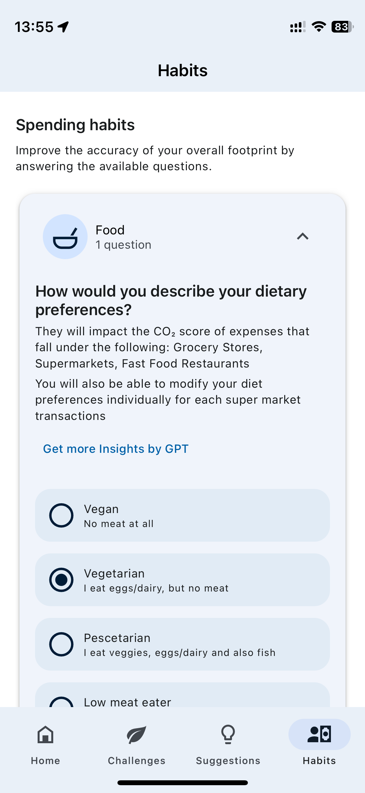

# Reduce your CO2 footprint using a smart Generative AI application on SAP BTP

 

  

## Description

Leverage a generalized approach to applying Generative AI to business challenges with SAP BTP. In this sample, you will deploy an SAP Cloud Application Programming backend that interacts with Azure AI and a React Native mobile app implementing a Smart CO2 Converter App. This samples CAP backend is based on [Consume OpenAI services (GPT) through CAP & SAP AI Core](https://github.com/SAP-samples/azure-openai-aicore-cap-api) as boilerplate code which implements parts of the [Reference architecture of an SAP BTP CAP application using GPT Models of OpenAI](https://github.com/SAP/sap-btp-reference-architectures/tree/main/hyperscalers/openai).

This use case can be replicated end to end following the respected [Discovery Center Mission: Reduce your CO2 footprint using a smart Generative AI application on SAP BTP](https://discovery-center.cloud.sap/protected/index.html#/missiondetail/4264/4522/)

> **Note** This repository demonstrates the utilization of Large Language Models (LLMs) like Azure OpenAI services on SAP Business Technology Platform (BTP) with the Reference Architecture, without implying environmental sustainability of LLMs.

## Challenge

How might we enable banking customers to be more climate conscious while strengthening their loyalty?

## Solution

Help users understand how their consumption habits are driving their CO2 footprint by showing most impactful expenses and best opportunities for emissions reductions.

## Outcome

A mobile app built using the reusable architecture principles of SAP Cloud Application Programming (CAP) model and React Native on SAP BTP. An application extension using GPT via the Azure Open AI service that combines business context with the capabilities of large language models on SAP BTP.

  
  
  
  

## Requirements

You can find the detailed pre-requisites for running each part of this use case mission in the [Table of Contents](documentation/DC_TOC.md)

<!-- disco-toc-start -->

### Explore and Discover

- [Explore the mission](./documentation/01-explore-the-mission/explore.md)<!-- dc-card: {"label":  ["Basics"]} dc-card -->
- [SAP Business Technology Platform](./documentation/01-explore-the-mission/BTP.md)<!-- dc-card: {"label":  ["Basics"]} dc-card -->
- [SAP BTP, Cloud Foundry Runtime](./documentation/01-explore-the-mission/cf-runtime.md)<!-- dc-card: {"label":  ["Basics"]} dc-card -->
- [SAP HANA Cloud](./documentation/01-explore-the-mission/hana-cloud.md)<!-- dc-card: {"label":  ["Basics"]} dc-card -->
- [SAP Destination Service](./documentation/01-explore-the-mission/destination-service.md)<!-- dc-card: {"label":  ["Basics"]} dc-card -->
- [Get started with Cloud Application Programming](./documentation/01-explore-the-mission/cap.md)<!-- dc-card: {"label":  ["Basics"]} dc-card -->
- [Get started with SAP AI Core & SAP AI Launchpad](./documentation/01-explore-the-mission/ai-core-launchpad.md)<!-- dc-card: {"label":  ["Basics", "AI"]} dc-card -->
- [Get started with React Native](./documentation/01-explore-the-mission/react-native.md)<!-- dc-card: {"label":  ["Basics"]} dc-card -->
- [ChatGPT and Large Language Models](./documentation/01-explore-the-mission/GPT-and-LLMs.md)<!-- dc-card: {"label":  ["Basics", "AI"]} dc-card -->
- [Get started with OpenAI Services](./documentation/01-explore-the-mission/azure-openai-services.md)<!-- dc-card: {"label":  ["Basics", "AI"]} dc-card -->
- [Reference Architecture of an SAP BTP CAP application using GPT Models of OpenAI](https://github.com/SAP/sap-btp-reference-architectures/blob/main/hyperscalers/openai/README.md)<!-- dc-card: {"label":  ["Basics", "AI"]} dc-card -->

### Technical Setup

- [Setup SAP BTP prerequisites](https://github.com/SAP-samples/azure-openai-aicore-cap-api/blob/main/documentation/00-prerequisites/01-setup-subaccount-cf-aicore.md)<!-- dc-card: {"label":  ["Prerequisites", "Hands-On"]} dc-card -->
- [Setup Docker Hub account and build & push your Docker Image](https://github.com/SAP-samples/azure-openai-aicore-cap-api/blob/main/documentation/01-ai-core-azure-openai-proxy/02-build-push-docker-images.md)<!-- dc-card: {"label":  ["Prerequisites", "Hands-On"]} dc-card -->
- [Register general artifacts on SAP AI Core and inspect in SAP AI Launchpad](https://github.com/SAP-samples/azure-openai-aicore-cap-api/blob/main/documentation/01-ai-core-azure-openai-proxy/03-register-general-artifacts.md)<!-- dc-card: {"label":  ["Hands-On", "AI"]} dc-card -->
- [Deploy the Inference Service on SAP AI Core as Proxy for Azure OpenAI Services](https://github.com/SAP-samples/azure-openai-aicore-cap-api/blob/main/documentation/01-ai-core-azure-openai-proxy/04-setup-deployment-inference-service.md)<!-- dc-card: {"label":  ["Hands-On", "AI"]} dc-card -->
- [Test and play with deployed service](https://github.com/SAP-samples/azure-openai-aicore-cap-api/blob/main/documentation/01-ai-core-azure-openai-proxy/05-test-deployed-service.md)<!-- dc-card: {"label":  ["Optional", "Hands-On"]} dc-card -->
- [Expo Go Client & Expo Account](./documentation/02-technical-setup/07-expo.md)<!-- dc-card: {"label":  ["Optional", "Hands-On"]} dc-card -->
- [Setup Business Application Studio](https://github.com/SAP-samples/successfactors-extension-calculate-employee-seniority/blob/mission/03-ConfigureSAPBusinessApplicationStudio/README.md)<!-- dc-card: {"label":  ["Prerequisites", "Hands-On"]} dc-card -->

### Application Deployment

- [Application Architecture](./documentation/03-application/01-application-architecture.md)<!-- dc-card: {"label":  ["Basics", "Important"]} dc-card -->
- [Data Model and provided Data](./documentation/03-application/02-data-model.md)<!-- dc-card: {"label":  ["Basics", "Important"]} dc-card -->
- [Preparatory Steps](./documentation/03-application/03-preparatory.md)<!-- dc-card: {"label":  ["Hands-On", "Important"]} dc-card -->
- [Prepare CAP Deployment](https://github.com/SAP-samples/azure-openai-aicore-cap-api/blob/main/documentation/02-cap-api/01-prepare-cap-deployment.md)<!-- dc-card: {"label":  ["Hands-On", "Important"]} dc-card -->
- [Deploy CAP API to Cloud Foundry](./documentation/03-application/05-cap-deployment.md)<!-- dc-card: {"label":  ["Hands-On", "Important"]} dc-card -->
- [Attach SAP AI Core to CAP API](https://github.com/SAP-samples/azure-openai-aicore-cap-api/blob/main/documentation/02-cap-api/03-attach-aicore.md)<!-- dc-card: {"label":  ["Hands-On", "AI"]} dc-card -->
- [Run the Mobile App (React Native)](./documentation/03-application/07-run-mobile-app.md)<!-- dc-card: {"label":  ["Hands-On", "Important"]} dc-card -->
- [Publishing the Mobile App](./documentation/03-application/08-publish-mobile-app.md)<!-- dc-card: {"label":  ["Hands-On", "Optional"]} dc-card -->

### AI Insights

- [Synthetic Data through Generative AI](./documentation/04-data-setup/AI-data-setup-overview.md)<!-- dc-card: {"label":  ["Basics", "AI"]} dc-card -->
- [AI Application Features (OpenAI Services)](./documentation/05-AI-features/AI-application-features-overview.md)<!-- dc-card: {"label":  ["Basics", "AI"]} dc-card -->

### Completion

- [Retrospective](./documentation/06-complete/retrospective.md)<!-- dc-card: {"label":  ["Summary"]} dc-card -->
- [Outlook](./documentation/06-complete/outlook.md)<!-- dc-card: {"label":  ["Summary"]} dc-card -->
  <!-- disco-toc-end -->

## Known Issues

None

## How to obtain support

[Create an issue](https://github.com/SAP-samples/smart-co2nverter-ai/issues) in this repository if you find a bug or have questions about the content.

For additional support, [ask a question in SAP Community](https://answers.sap.com/questions/ask.html).

## Contributing

Thanks to all collaborators to make this app real!

- [Adi Pleyer](https://github.com/AdiPleyer)
- Armando Aguinaga
- [Gerd Buchmüller](https://github.com/D022666)
- Heike van Geel
- [Iyad Al Hafez](https://github.com/Iyad-Alhafez)
- [James Rapp](https://github.com/jmsrpp)
- [Julian Schambeck](https://github.com/julian-schambeck)
- Karen Detken
- [Kay Schmitteckert](https://github.com/kay-schmitteckert)
- Rainer Rodewald
- Simon Nowack
- [Sudheer Tammana](https://github.com/sudheer-tammana)
- Vikas Thimmiaha

If you wish to contribute code, offer fixes or improvements, please send a pull request. Due to legal reasons, contributors will be asked to accept a DCO when they create the first pull request to this project. This happens in an automated fashion during the submission process. SAP uses [the standard DCO text of the Linux Foundation](https://developercertificate.org/).

## License

Copyright (c) 2022 SAP SE or an SAP affiliate company. All rights reserved. This project is licensed under the Apache Software License, version 2.0 except as noted otherwise in the [LICENSE](LICENSE) file.
