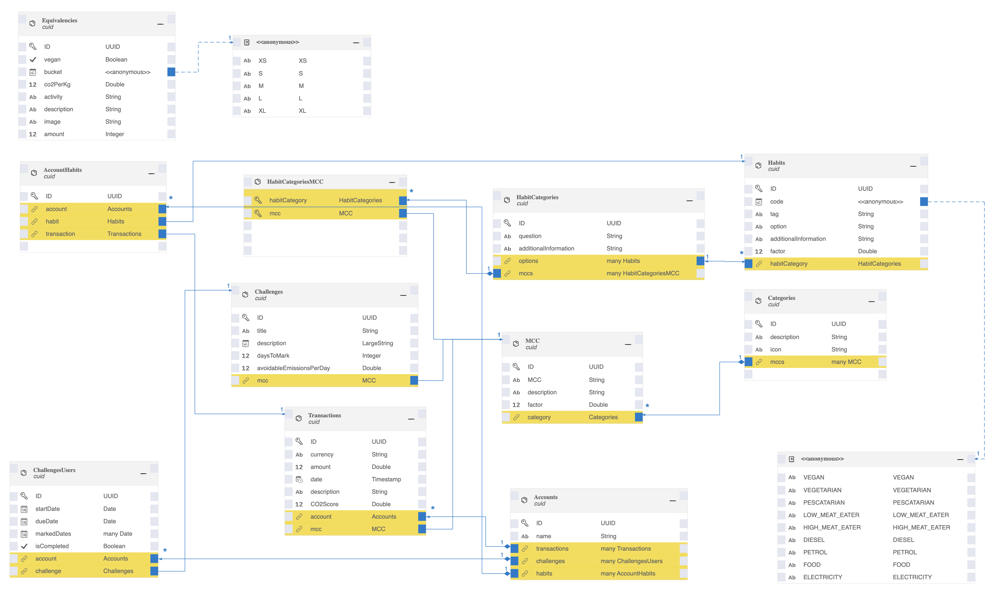

# Data Model and provided Data

This following data model is used to track a user's bank transactions, calculate CO2 scores, offer CO2 reduction challenges and allow users to track their own spending habits to help reduce their CO2 footprint.

## Entities & Data

Listed below is a brief explanation of all entities:

- **Transactions** stores details about a bank transaction, such as the account, currency, amount, date, description and merchant category code (MCC). The virtual CO2 score attribute is used to store the calculated CO2 score for the transaction. In the sample data we provide about 2 years of mocked transaction data.
- **Challenges** stores information about CO2 reduction challenges that can be offered to the user. The attributes include the title, description, MCC, daysToMark and avoidableEmissionsPerDay. In the data we provide 2 sample challenges regarding diet and mobility.
- **ChallengesUsers** represents the user's participation in a CO2 reduction challenge. The attributes include the account, challenge, start date, due date, marked dates and completion status.
- **Equivalencies** stores the CO2 equivalency factors for various activities, based on the amount of CO2 emitted per unit of activity. The attributes include whether the activity is vegan, the per kg CO2 per unit, the activity description and an image. In the sample data, we provide quite a few AI generated equivalencies.
- **Accounts** represents a user's account and includes the name, associated transactions, challenges and spending habits. In the sample data, one single user is specified to whom all transactions are linked.
- **Categories** acts as a grouping layer for the merchant category codes (MCCs) used in transactions. The attributes include the description, icon and the associated MCCs.
- **MCC** represents the [merchant category code (MCC)](https://en.wikipedia.org/wiki/Merchant_category_code) used in a transaction. The attributes include the MCC itself, the description, a factor used to calculate the CO2 emissions and the associated category.
- **HabitCategories** stores information about the various spending habit categories that the user can select. The attributes include the question, additional information, associated options and associated MCCs.
- **HabitCategoriesMCC** is used to associate the HabitCategories entity with the MCC entity.
- **Habits** stores the user's spending habits, such as whether they are vegan, vegetarian, or low/high meat eaters and their impact on CO2 emissions. The attributes include the habit category, code, tag, option, additional information and factor. With the sample data we support nutrition and purchases at gas stations.
- **AccountHabits** represents the association between a user account, a spending habit and a transaction.
