# Data Setup powered by AI

> **Disclaimer** The data showcased in this section is solely generated by LLMs, serving as a demonstration of their potential utilization in sample scenarios or prototypes. However, it does not indicate this is sourced from Connect Earth, nor does it guarantee specific outcomes or carbon footprinting accuracy through prompt engineering techniques, as results may vary based on various factors. 
Looks great and I think these disclaimers help a lot from an environmental claims risk perspective.

We want to make use of Generative AI aka Generative Pre-trained Transformer (GPT) offered via the Azure OpenAI service for collecting and generating information and basic data, which will be included in our database and used by our application. This is kind of the build or setup time of the applications.

- [Categories](#categories) are needed for assigning the bank transaction into those categories and later to determine the CO2 impact of those.
- [Habit Factors](#determining-factors-for-different-habits) indicate how the CO2 impact is changing depending of different habits of the user.
- [Equivalencies](#generating-equivalencies) are needed to have a tangible comparison for the CO2 comsumption.
- [Pictures for equivalencies](#generate-equivalencies-and-related-pictures) support the visual understanding of the equivalencies.

# Categories

One central aspect of our application are categories which are used to group the payments into logically belonging chunks and also can be helpful when calculating the CO2 factors. Of course there can be different reasons, why you might want to use an existing category hierarchy or even define your own. On the other hand, chances are that the upfront defined categories will not be really useful if they do not match the banking transactions.

Therefore, we want to show, how LLMs can be used to determine categories based on the actual data. The following is just a brief show of how such an approach might work in general. But even so, it already shows some nice results.

As a first step, we can simply take a more or less representative set of records and from those we need only the receiver of the bank transaction. If the receiver is not a field in your records, the text might also be a candidate.

Then, with a prompt like the following, ChatGPT can be asked to assign them to categories. The categories could be given, or as in the case below just left open. ChatGPT returns

```
The following is a list of receivers of my payments. Propose a categorization of those into a flat list of categories like "FOOD", "HEALTH", "MEDIA" and more.

01156 MCDONALDS
0145 C+A FRIEDRICHSHAFEN
01767 MCDONALDS
1+1 Mail + Media GmbH
1u1 MAILUMEDIA GMBH-GMX
2125 C+A WIESLOCH
5100.01.08.00013
5101 ECENTER MANNH.- NEUOS
521 ZG WIESLOCH
8151 ZG Raiffeisen Baustoffe GmbH
A.T.U AUTO-TEILE-UNGER
ALDI SUED SAGT DANKE
ANETTES FLORISTIK
ANTIMISARIS GBR, NUSSLOCH
AQUA-ZOO-SHOP WIESLOCH E.K.
ART FLOWERS
Athidhi Restaurant
(about 100 more not lister here)

Return a table with two columns: receiver | category.
```

The first result is already promissing (excerpt):

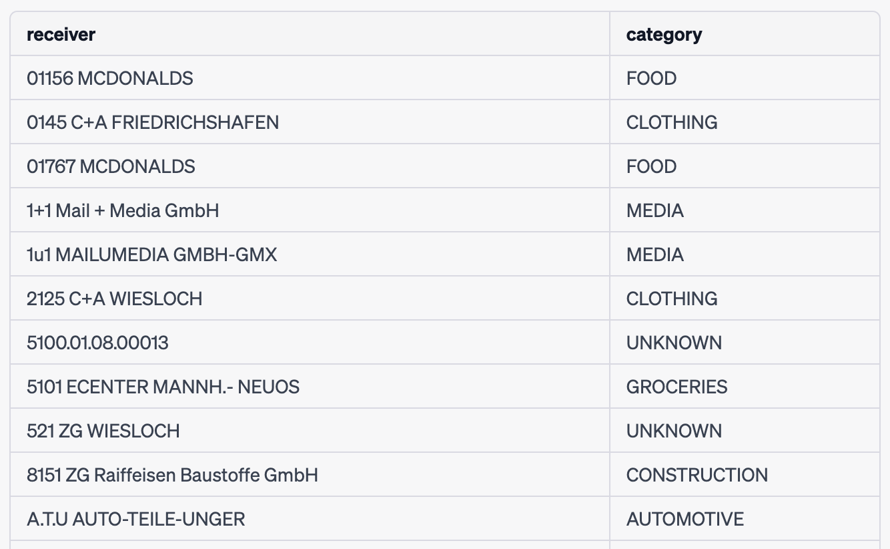

Let's ask for structuring the categorization into two levels (again just an excerpt):

```
Now take the same list above and propose a two-level hierarchy of categories
```

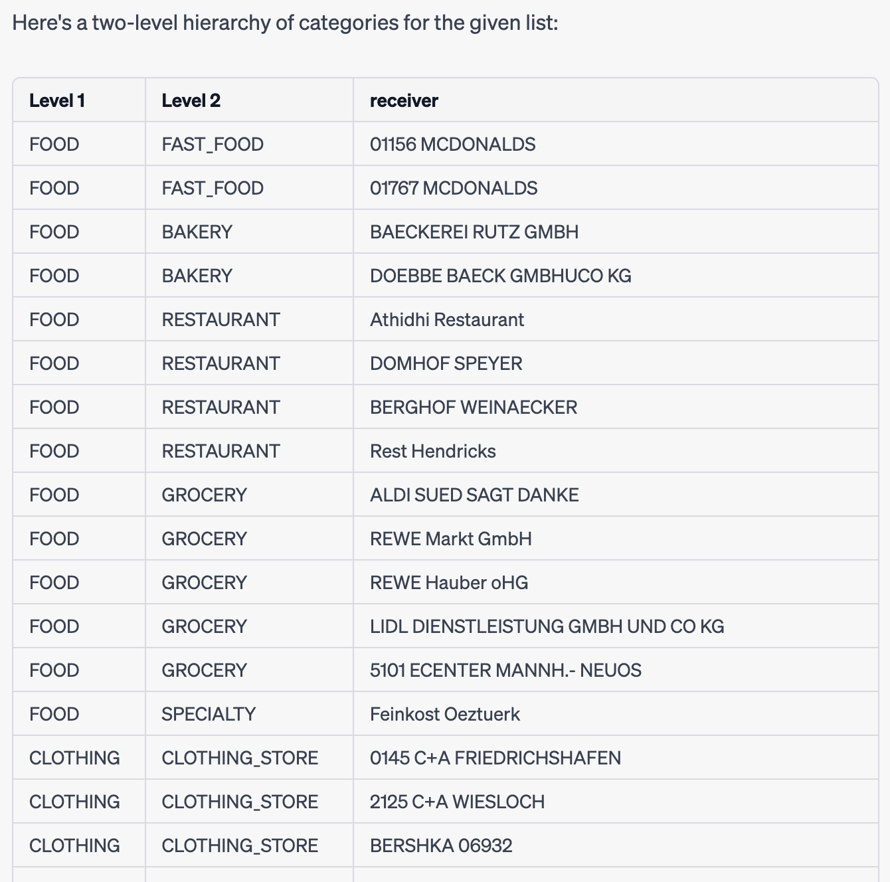

After one more refinments:

```
Return just the two-level hierarchy alone

Merge the SPORTS branches into the HEALTH category, also merge FLORIST and REAL_ESTATE into HOME
```

We arrive to the following two-level hiararchy:

FOOD

- FAST_FOOD
- BAKERY
- RESTAURANT
- GROCERY
- SPECIALTY

CLOTHING

- CLOTHING_STORE

HEALTH

- PHARMACY
- MEDICAL_SERVICE
- INSURANCE
- BICYCLE_SHOP
- FITNESS_CENTER

MEDIA

- ONLINE_MEDIA
- PRINT_MEDIA

TRANSPORTATION

- PUBLIC_TRANSPORT
- AIRPORT_PARKING

ENTERTAINMENT

- RECREATIONAL_FACILITY
- AMUSEMENT_PARK

UTILITIES

- ENERGY_PROVIDER
- WASTE_MANAGEMENT

FINANCIAL_SERVICES

- BANK
- INSURANCE

BEAUTY

- HAIR_SALON
- PERSONAL_CARE

HOME

- FURNITURE
- CONSTRUCTION
- APPLIANCES
- FLOWER_SHOP
- PROPERTY_MANAGEMENT

PETS

- PET_STORE
- VETERINARY_SERVICE

CHARITY

- NON_PROFIT_ORGANIZATION

EDUCATION

- SCHOOL_SUPPORT

TAX

- GOVERNMENT_FINANCE

UNKNOWN

- UNDEFINED

Of course, this does not need to be the last step, more refinements are possible and also manual curating makes sense in some details. The resulting category scheme can be easily applied to categorize the transactions in detail. In this special case, the categorization can be a simple matching of the recipienet into the proper category and thus not every single transaction needs to be categorized, making the whole process more efficient.

# Determining Factors for Different Habits

Within a productive implementation of our application, we would calculate the approximate CO2 consumption of the individual expenses using an [external source (e.g., ConnectEarth)](../06-complete/outlook.md#emission-factors-by-connectearth). In one expense, especially like one for food, a general average is applied.

To improve the accuracy of those factors, we allow the user to specify a deviation from the average diet, applicable overall or for just one individual expense. Then we can apply a correction factor for adjusting (mostly reducing) the CO2 amount. E.g., if the user claims to live a vegetarian diet, it is fair to assume that the CO2 impact is reduced on average.

The factors are available in public literature, so we decided to ask ChatGPT to determine them and prepare a table which we can apply to adjust the CO2 calculation.

## Dietary Habits - Prompt Sequence

The factors were determined as a result of a lengthier conversation. Here are the prompts which collected the relevant information step by step and finally asked for a complete table. Intermediate results are not presented.

```
What is the average expected change in the CO2 consumption when changing from an average diet to a vegetarian diet. Can you give me a factor?

...

What about a pescatarian diet?

...

Can you give me factor for reduction when changing from an average diet to a pescatarian diet?

...

What would be the co2 impact of a diet changing from an average diet to a diet of a high meat eater or a low meat eater?

...

Now, could you please put all factors together in a table of the form:

diet | description | co2 consumption factor
---+---+---
average diet | allowing all sorts of nutrition | 100%
vegerarian diet | ...
```

## Dietary Habits - Result

```
Here's a table with the CO2 consumption factors for various diets, based on the information provided earlier. Please note that these factors are approximate values and can vary depending on individual food choices, production methods, and other factors.
```

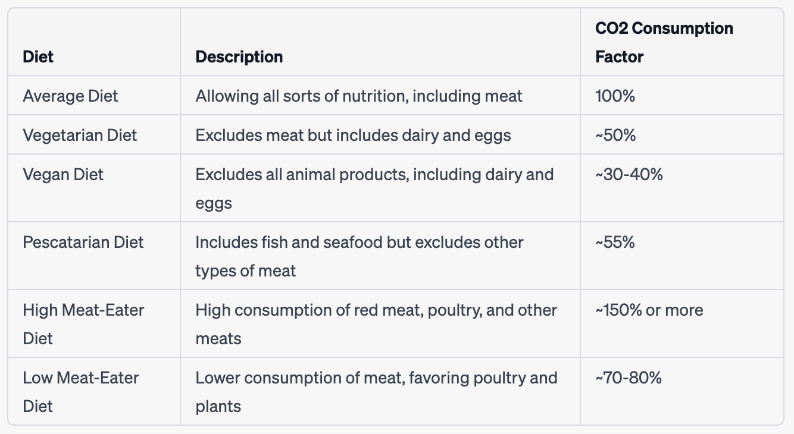

```
Keep in mind that these percentages are rough estimates, and the actual CO2 impact of each diet may vary. To reduce your carbon footprint, prioritize plant-based protein sources, consume fewer animal products (especially red meat), and choose sustainably sourced food items whenever possible.
```

The following sources were provided on further request:

1. Scarborough, P., Appleby, P. N., Mizdrak, A., Briggs, A. D., Travis, R. C., Bradbury, K. E., & Key, T. J. (2014). Dietary greenhouse gas emissions of meat-eaters, fish-eaters, vegetarians, and vegans in the UK. Climatic Change, 125(2), 179-192. [Link](https://link.springer.com/article/10.1007/s10584-014-1169-1)
2. Tilman, D., & Clark, M. (2014). Global diets link environmental sustainability and human health. Nature, 515(7528), 518-522. [Link](https://www.nature.com/articles/nature13959)
3. Heller, M. C., & Keoleian, G. A. (2018). Greenhouse gas emission estimates of US dietary choices and food loss. Journal of Industrial Ecology, 22(3), 614-629. [Link](https://onlinelibrary.wiley.com/doi/abs/10.1111/jiec.12635)
4. Poore, J., & Nemecek, T. (2018). Reducing food’s environmental impacts through producers and consumers. Science, 360(6392), 987-992. [Link](https://science.sciencemag.org/content/360/6392/987)

These sources provide information on the environmental impacts of different diets, including greenhouse gas emissions, land use, and other sustainability metrics. The CO2 consumption factors presented in the previous answer are approximate values derived from these studies, but please note that individual diets and food choices may lead to different results.

## Fuel Type Consumption

Similar to the dietary habits, we can adjust the CO2 for the payments at the gas station. The expense record typically does not reveal which type of fuel has been purchased or if the electric car has been charged.

```
What is the difference in CO2 consumption between cars with different type of drive.  Consider the following types of drive: petrol, diesel, electric and average. For each of those, assume a spending of 100 Euro at the gas station and determine the according amount of CO2 which it roughly relates to. Give be a table of the following structure:

drive | CO2 equivalent
---+---
petrol | ...
```

## Fuel Type - Result

The following results shows that the calculation is depending on several assumptions which are of course subject to change. Still in our case, we can use the results to calculate adjustement factors. We will assume diesel as the default, such that adjusting the fuel type will lead to decrease of the CO2 if different to diesel.

```
To create a comparison table of CO2 equivalent for different types of drives, we first need to determine the approximate fuel efficiency and emissions per fuel type, as well as the current fuel prices. Since the fuel prices constantly change, we will use an approximation for each type of fuel. Please note that these figures may not be accurate at the time you are reading this response.
```

Assumptions:

1. Fuel prices (approximate):
   - Petrol: 1.50 Euro/liter
   - Diesel: 1.40 Euro/liter
   - Electricity: 0.20 Euro/kWh
2. Fuel efficiency (approximate):
   - Petrol: 15 km/liter
   - Diesel: 20 km/liter
   - Electric: 5 km/kWh
3. CO2 emissions (approximate):
   - Petrol: 2.3 kg CO2/liter
   - Diesel: 2.7 kg CO2/liter
   - Electric: 0.2 kg CO2/kWh (assuming grid electricity mix)

```
With these assumptions, we can calculate the CO2 equivalent for each type of drive after spending 100 Euro at the gas station:

drive | CO2 equivalent
---+---
petrol | 153.33 kg
diesel | 192.86 kg
electric | 10.00 kg
average | 118.73 kg

Note that the average CO2 equivalent is calculated by taking the average of the CO2 emissions for petrol, diesel, and electric drives. These figures are only rough estimates and may vary depending on factors such as vehicle efficiency, fuel prices, and the carbon intensity of electricity generation.
```

# Generating Equivalencies

This AI task is used for preparing the application data. We use ChatGPT to generate examples of CO2 consumption which can be used to give the user a feeling about the amounts of CO2 and how they can be related to everydays activities or products.

## Prompt

First attempt of the prompt worked already quite OK

```
I want to explain in a tangible way how much CO2 consumption is caused by an activity or a product. Generate a table with the following entries: activity or product | t-shirt size | CO2 in kg | description.
Make sure you generate entries per each of the t-shirt sizes (XXS, XS, S M, L, XL).
In the description field, enter the placeholder "YYY" which can be later replaced by the number of activities or products.
Example:

activity or product | t-shirt size | CO2 in kg | description
---+---+---+---
Using a plastic bag | XXS | 0.01 kg | YYY plastic bags used for shopping
```

## Result

```
Here is a table with activities or products, their corresponding t-shirt size, CO2 in kg, and a description with a placeholder "YYY":
```

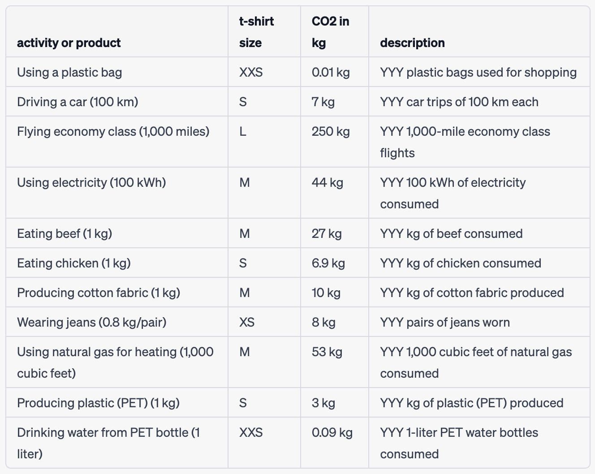

```
Remember to replace the "YYY" placeholder with the actual number of activities or products to get a tangible understanding of the CO2 emissions associated with each entry. Note that these figures are approximate and can vary based on factors such as efficiency, location, and specific processes used.
```

## Refinements

Few more interactions with ChatGPT helped to extend the equivalencies table and add specific lines.

```
Very nice, please generate 20 more examples.
```

...

```
Now put all examples into one single table and leave out those which would not be relevant for a vegan or vegetarian person
```

...

```
Now, add 20 more examples which would also be understandable for non-vegetarians or meat eaters.
```

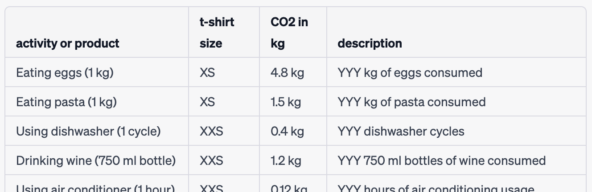

```
Now, 10 more examples which are purely related to any sorts of meat consumption
```

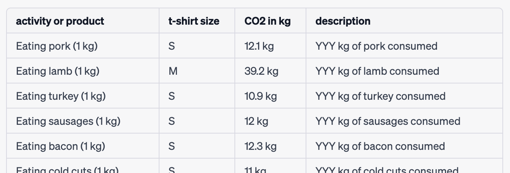

## Final result

The final result is a joint table of all three partial results which in the end need a small massage to fit into the according database table for the application. Excel and find/replace are a good helper here.

Especially the T-Shirt sizes and their function were not precisely described in the prompt, so they needed to be recalculated based on the CO2 amount. This is anayways a part of the use case, where a precise calculation with a simple formula cann be applied and delivers a stable result. Even with a more sophisticated prompting, such a functional dependency can sometime deliver strange results by a language model.

# Generate Equivalencies and Related Pictures

We want to have pictures in our application to depict or symbolize the [previously generated equivalencies](./assets/AI-equivalencies.md)

The basic idea is to use Generative AI again to generate those pictures, this time of course an AI like [DALL-E](https://openai.com/product/dall-e-2) or [Stable Difussion](https://stability.ai/stable-diffusion) which take a text prompt and generate an according picture.

In our case, we want the prompt to be generated as well by ChatGPT, because we are lazy. So let the one AI feed the other...

## Approach

In a first step, we wanted to take the texts of the previously generated equivalencies and generate the prompts out of these. This turned out to be not great because the resulting prompts already were strange and not yealding the desired pictures. The reason is that the texts were too much poluted with information which is not helpfull in focussing on the main subject. Example: "Eating beef (1kg)" contains the word eating and then what should the prompt for the picture focus on, beef or the act of eating? In our case, we want to see the beef rather than the eating process.

So, the next step was to merge the two tasks into a single one and generate the equivalencise together with the prompt. This way, we can first ask for the product or food or activity as an isolated term and from this the generation of the description and also the picture prompts gives better results, because it not unnecessarily confused.

Still, one tiny problem remains in the wording which is caused by the fact that we have different categories of equivalencies which we want to address. Products are basically different from food and also different from activities. Therefore, it is useful to split the generation of all equivalencies into several blocks, separating products from food from activities and others. This makes it possible to adjust the promts specificly, on the level of ChatGPT as well as the prompts generated for the pictures. For example, no persons to be included into the products picture, while we want persons to be shown with activities, als specific requests for food diferring by diet, and specifying portion size can be done in a targeted way, and not confusing other categories.

## Solution

We are using ChatGPT (GPT-4) in the interactive version with the following prompts and results. As you can see, they are split by the categories and contain category specific adjustments.

We start with general products asking for a picture prompt without persons included.

```
In an application which calculates the CO2 consumption from banking transactions, I need examples for products, how much CO2 is emitted in their production and also pictures symbolizing those products.
Do not include food.
For the picture I want a prompt to ask an AI like Dall-E to generate such an images. Give me all information in a table of the structure:

| product | CO2 in kg | description | prompt for AI to generate a symbolic picture of the product |
---+---+---+---
| pair of jeans | 8 kg | X pairs of jeans bought | Depict a realistic image of a pair of jeans, no person. |
```

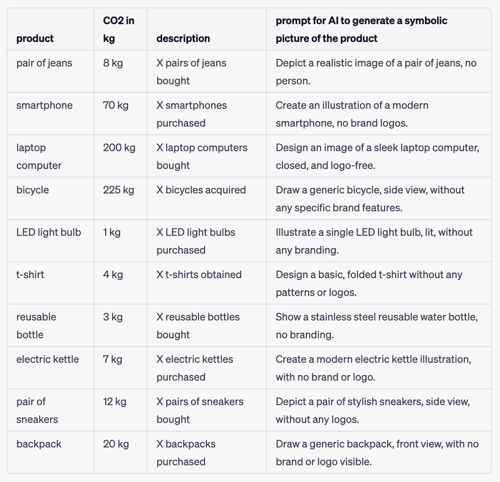

Next, we address food in general focusing on typical portion sizes. The example given in the prompt can direct the imaging AI into the desired direction.

```
In an application which calculates the CO2 consumption from banking transactions, I need examples for food products, how much CO2 is emitted in their production and also pictures symbolizing those food products.
Include food for an average, non-vegetarian diet. The amount of food should be a one portion size.
For the picture I want a prompt to ask an AI like Dall-E to generate such an images. Give me all information in a table of the structure:

| food product | CO2 in kg | description | prompt for AI to generate a symbolic picture of the food product |
---+---+---+---
| pork meat | 1.2 kg | X portions of 100 g pork meat eaten | Depict a realistic image of a pork meat dish on a plate. |
```

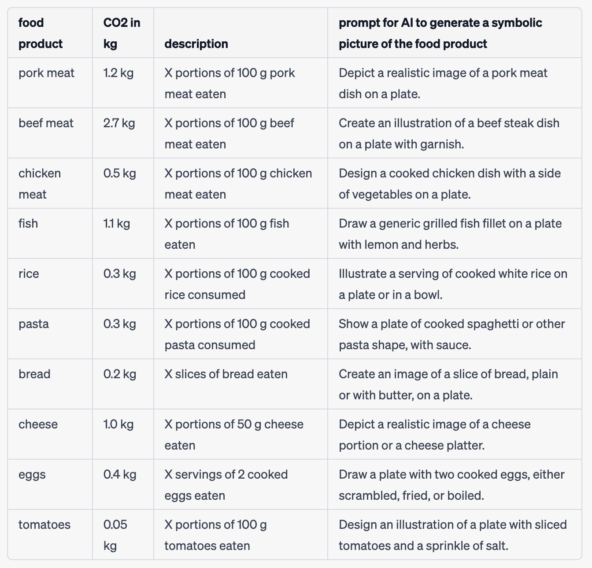

A specific category is vegan food, which we want to address separately also because later we want it to be separately marked for users having the vegan as a habit.

```
In an application which calculates the CO2 consumption from banking transactions, I need examples for food products, how much CO2 is emitted in their production and also pictures symbolizing those food products.
Only food suitable for a vegan diet. The amount of food should be a one portion size.
For the picture I want a prompt to ask an AI like Dall-E to generate such an images. Give me all information in a table of the structure:

| vegan food product | CO2 in kg | description | prompt for AI to generate a symbolic picture of the vegan food product |
---+---+---+---
| pasta | 0.15 kg | X portions of 100 g pasta consumed | Depict a realistic image of a pasta dish on a plate. |
```

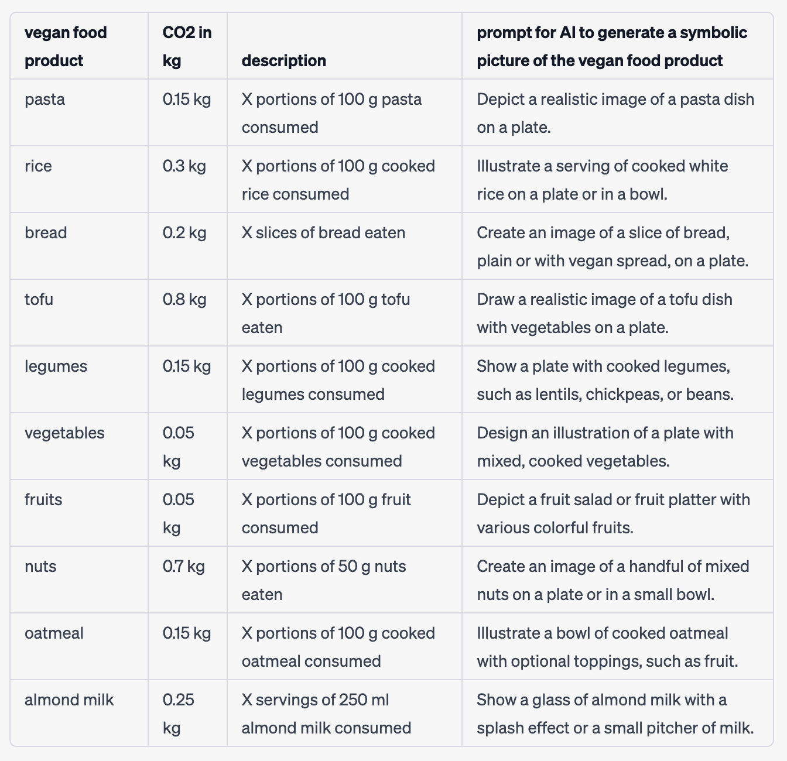

Drinks are getting an onw category as well, mainly to have a different examples for the image prompt.

```
In an application which calculates the CO2 consumption from banking transactions, I need examples for drinks, how much CO2 is emitted in their production and also pictures symbolizing those drinking products.
The amount of fluid should be a one portion size.
For the picture I want a prompt to ask an AI like Dall-E to generate such an images. Give me all information in a table of the structure:

| drinking product | CO2 in kg | description | prompt for AI to generate a symbolic picture of the drinking product |
---+---+---+---
| wine | 0.15 kg | X portions of wine consumed | Depict a realistic image of a glas of red wine on a table. |
```

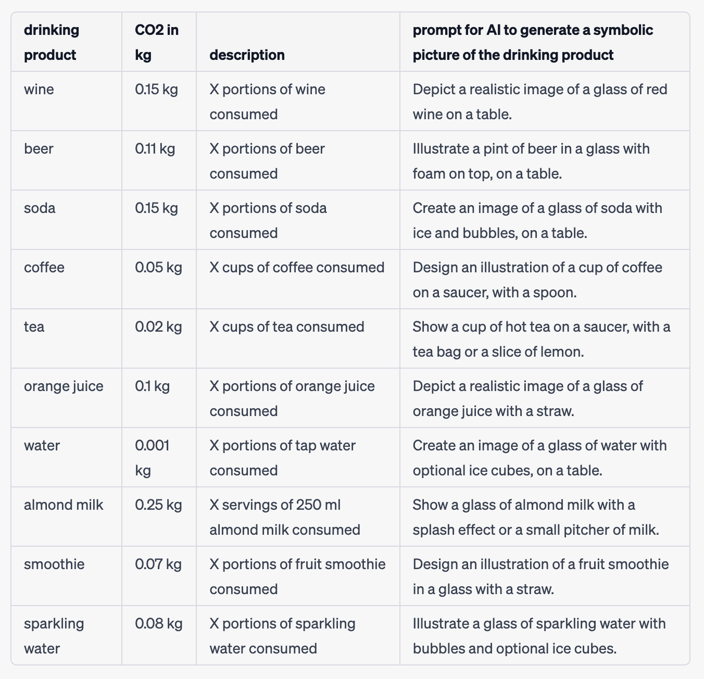

As last, we address activities. Here we can explicitely talk about activities instead of products and also the image prompt can specifically ask for a person to be included, assuming that an activity is symbolized better with a person involved.

```
In an application which calculates the CO2 consumption from banking transactions, I need examples for activities, how much CO2 is emitted in their execution and also pictures symbolizing those activities.
Consider typical daily activities including transportation and sports.
For the picture I want a prompt to ask an AI like Dall-E to generate such an image including a person executiong the activitiy. Give me all information in a table of the structure:

| activitiy | CO2 in kg | description | prompt for AI to generate a symbolic picture of this activity executed by a person |
---+---+---+---
| haidryer | 0.01 kg | X minutes using a hairdryer | Depict a realistic image of a person drying her hair with a hairdryer. |
```

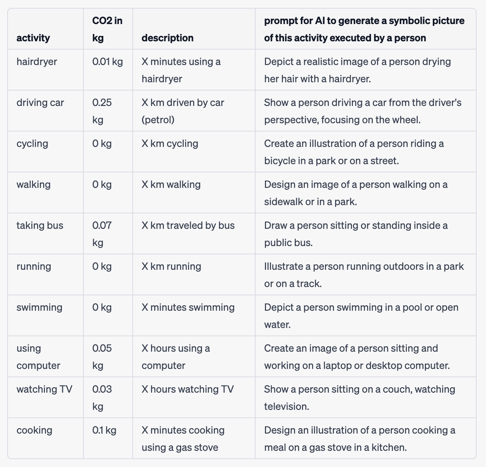

## Postprocessing

After all five tables are generated, we just need to bring the results into our database. For this, we join all results in an Excel sheet, give it some nice massage, e.g. the numbers need an appropriate treatment to survive the upload.

## Generating Images

As a last step, we need to pass the prompts to the imaging AI. In the first attempt, we used [Stable Difussion](https://stability.ai/stable-diffusion) to generate the pictures. This has been done manually, you anyways need to select the image typically one out of four and this way you can immediately decide to regenerate or even manually adjust the prompt if it should not fit at all. In our case, most of the prompts delivered a reasonable result in the first shot already.

The following are a few examples, each with the according prompt generated by ChatGPT above.

```
Depict a realistic image of a cheese portion or a cheese platter.
```

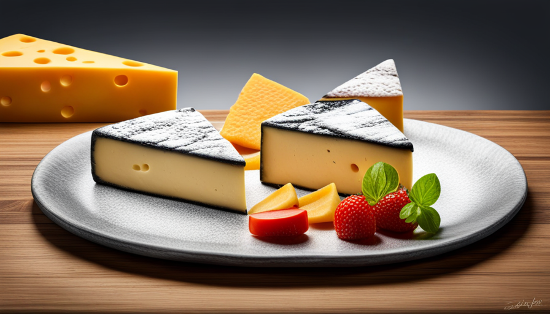

```
Design an illustration of a cup of coffee on a saucer, with a spoon.
```


```
Create an image of a handful of mixed nuts on a plate or in a small bowl.
```

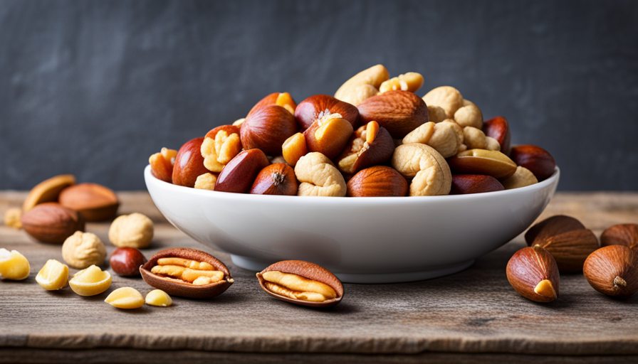

```
Create an illustration of a modern smartphone, no brand logos.
```


```
Create an image of a person sitting and working on a laptop or desktop computer.
```


## Portion size of food

Just as a remark, in the context of food, we asked ChatGPT what a portion size means:

```
A typical portion size for meat consumption varies depending on the type of meat and individual preferences. However, a general guideline is to consume around 85 to 100 grams (3 to 3.5 ounces) of cooked meat per serving. This is roughly equivalent to the size of a deck of playing cards or the palm of your hand. Keep in mind that portion sizes may vary across cultures and dietary needs.
```

This can be understood as a being part of a meal, as opposed to situations were ... a 85 grams steak? well... ;-)
