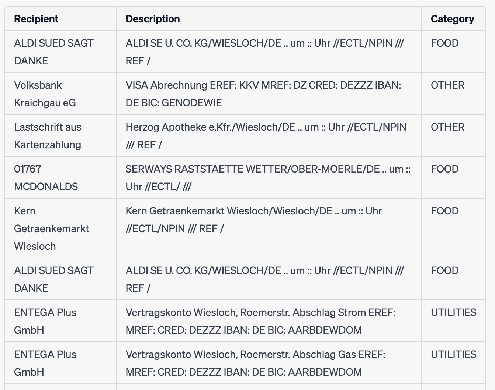

# AI Application Features

We want to also use the capabilities of a large language model for combining their input and results with the business data and application context at the runtime of the application. In this case it is essential to also be mindful of the data privacy aspect and avoid disclosing critical data to the cloud AI if not necessary.

The following features are integrated into the application and involved and runtime. Therefore, at the time of developing, we can only make use of GPT-3.5 accessed from SAP BTP through SAP AI Core.

- [Summary of the Current Situation](#situation-summary) will give the user an overview of the CO2 consumption status.
- [Recommendations to reduce CO2](#recommendations) help to reduce the CO2 in individual categories
- [Navigation in the Application](#in-app-navigation) can be an alternative access to the application functions.
- [Provider Conversation](#generate-an-email-to-energy-provider) helps the user to interact with providers on contract or their conditions.
- [Categorization of Transactions](#categorization-of-transactrions) can be the core part of the application.
- [More Recommendations](#more-recommendations) can offered to the user in the dietary context, in transportation or the challenges the user can engage in.

# Situation Summary

When entering the application, the user is presented the current month CO2 consumption and when swiping the history of previous months.

As an alternative, We want to provide a spoken summary of the values displayed. This is optional, but could be useful for a user who wants to consume the information while visually focusing on something else, maybe driving a car.

In order to ask the AI to provide a reasonable summary, we need to construct a prompt which is partly fix and partly filled programatically with current application data before sent to the Generative AI.

## Summary 1

Here is a snippet of what needs to be done in the applications to construct the prompt. The input is assumed to be an array of pairs [category, co2].

```
current_month_prompt_string = `
The following is a table of my CO2 consumption of the current month for different categories of spendings:

| Category | CO2 consumption in kg |
---+---
`;

// filter out zeros
current_month_input = current_month_input.filter(([category,co2]) => co2 > 0);

// generate table content inside prompt
current_month_input.forEach(([category, co2]) => {
    current_month_prompt_string += "| " + category + " | " + co2 + " |\n";
});
current_month_prompt_string += `

Tell me which category has the highest consumption.
Also propose three measures how I could decrease the CO2 consumption fo this category.
No table please, just a plain text which I can listen to in spoken speech and numbers rounded.
`;
```

The resulting prompt which is sent to the AI, might look like this:

```
The following is a table of my CO2 consumption of the current month for different categories of spendings:

| Category | CO2 consumption in kg |
---+---
| Miscellaneous Stores | 141.78 |
| Professional Services and Membership Organizations | 10.76 |
| Retail Outlet Services | 176.29000000000002 |
| Transportation Services | 7.58 |


Tell me which category has the highest consumption.
Also propose three measures how I could decrease the CO2 consumption fo this category.
No table please, just a plain text which I can listen to in spoken speech and numbers rounded.
```

Depending on the processing model, the result will differ in the style and level of detail. In our case, we need to use GPT-3.5 through the available API, which yields this:

```
The category with the highest CO2 consumption is Retail Outlet Services with 176.3 kg. To reduce the CO2 consumption in this category, you could:

1. Shop for items online instead of in-store, as this will reduce the amount of transportation required.

2. Look for items made from recycled materials, as this will reduce the amount of energy needed to produce them.

3. Buy items in bulk, as this will reduce the amount of packaging and transportation required.
```

## Summary 2

Again the input in an array of triplets [year, month, co2] sorted in order of time.

```
// construct the prompt for summary 2 - trend of the past months

history_input = [["2022", "September", "168.86"], ["2022", "October", "433.70"], ["2022", "November", "671.18"], ["2022", "December", "2404.01"],
["2023", "January", "756.76"], ["2023", "February", "500.61"], ["2023", "March", "473.61"], ["2023", "April", "336.41"]]

history_prompt_string = `
The following is a table with my CO2 consumption in the previous months, last one is the current month:

| Year | Month | CO2 consumption in kg |
---+---+---
`;
history_input.forEach(([y, m, v]) => {
    history_prompt_string += "| " + y + " | " + m + " | " + v + " |\n";
});

history_prompt_string += `

Give me a summary on how my consumption has evolved over the past months.
Then give me a trend over the last three months only.
Finally, rate my progress whether it is improving or worsening.
No table please, just a plain text which I can listen to in spoken speech and numbers rounded.

Your CO2 consumption...

The trend over the last three months...

Your progress...
`;
```

This would be the prompt resulting from the above processing.

```
The following is a table with my CO2 consumption in the previous months, last one is the current month:

| Year | Month | CO2 consumption in kg |
---+---+---
| 2022 | September | 168.86 |
| 2022 | October | 433.70 |
| 2022 | November | 671.18 |
| 2022 | December | 2404.01 |
| 2023 | January | 756.76 |
| 2023 | February | 500.61 |
| 2023 | March | 473.61 |
| 2023 | April | 336.41 |


Give me a summary on how my consumption has evolved over the past months.
Then give me a trend over the last three months only.
Finally, rate my progress whether it is improving or worsening.
No table please, just a plain text which I can listen to in spoken speech and numbers rounded.

Your CO2 consumption...

The trend over the last three months...

Your progress...
```

GPT-3.5 would again yield some solid response:

```
Your CO2 consumption has increased significantly over the past months. In September, your consumption was 168.86 kg, and in December it had increased to 2404.01 kg. Over the last three months, your consumption has decreased from 756.76 kg in January to 473.61 kg in March. This shows a downward trend in your consumption over the last three months. Your progress is improving, as your CO2 consumption has decreased over the last three months.
```

## Conclusion

With a well prepared set of data, we can fill a prompt and ask for a spoken text to describe the current situation of the users CO2 consumptions from different perspectives.

Important remains, that no matter what level the AI is, any processing of data which can easily be done before filling into the prompt should IMHO be done in the application. The Generative AI is string on language processing and can be focussing on this.

# Recommendations

The GPT-3 model can nicely be used to give recommendation on topics which are general knowledge or common sense.

## Embedding into Application

Whenever the user wonders how they can reduce the CO2 footprint for a certain category or type of expenses, we can offer a simple button which triggers the request to GPT-3 and display the recommendations returned.

## Prompt

The prompt can contain category and related habits coming from the application but not disclosing any critical data. The category is inserted into the prompt before the request is sent.

```
Give me some recommendations on how to reduce CO2 consumption in the category "Food". Consider the fact that I am already living a vegan diet.
List the recommendations in a JSON data structure.
```

## Result

Result comes as wished in a JSON format and can easily be processed for the display in the application:

```
{
"Food": [
    {
    "Number": 1,
    "Recommendation": "Buy locally grown and seasonal produce to reduce transportation emissions"
    },
    {
    "Number": 2,
    "Recommendation": "Plan your meals to minimize food waste"
    },
    {
    "Number": 3,
    "Recommendation": "Store food properly to extend its shelf life and reduce waste"
    },
    {
    "Number": 4,
    "Recommendation": "Grow some of your own fruits, vegetables, and herbs if possible"
    },
    {
    "Number": 5,
    "Recommendation": "Support sustainable farming practices by purchasing organic and regenerative produce"
    },
    {
    "Number": 6,
    "Recommendation": "Reduce the use of plastic packaging by buying in bulk and using reusable containers"
    }
]
}
```

# In-app Navigation

See the [Pre-POC](https://github.tools.sap/PAA-SCE-EMEA/CO2-navigation-chatbot) for a first idea in Python

To be adapted to actual application and also to JavaScript.

## Embedding into Application

Here is maybe a method how to do speech recognition in a React Native application:
[Tutorial: React Native Speech Recognition](https://medium.com/jeremy-gottfrieds-tech-blog/tutorial-react-native-speech-recognition-d9ae54960565)

Result of this would then be passed to GPT. The GPT result could then be used to trigger navigation within the application, see [Result](#result)

## Prompt

The prompt asks GPT to identify the action and category out of the users input. It is prepared in two steps. First step fills the actions and categories from an internal data structure into the prompt. This way, the control over the actions and categories stays integrated withing the application, thus can be used for all other functions of the application. It can also be the other way, the application comes with categories which are defined through data of configuration and they can be reused here as well. Only the explanation / description needs to be added.

This is the initial generic prompt:

```
My application supports the following actions:
<table of prompt actions>

Category X can be one of the following:
<table of prompt category definition>

Which action and category would you offer the user when they ask the following:
"<user input>"
Simply say the action and category if applicable. Show in a JSON data structure:
```

After filling the actions and categories, the prompt might look like that, still with a place holder for the user input:

```
My application supports the following actions:
1. "suggestions for X" - when the user is asking to show suggestion on how to reduce the CO2 consumption in category X
2. "transactions for X" - when the user wants to know which spendings or payments are assigned to the category X
3. "challenge" - when the user want to start or update a challenge he has active

Category X can be one of the following:
- Health: all things related to health, sports, outdoor activities, doctors and similar
- Food: eating, nutrition, nourishment, steaks, french fries, bread, eggs fruits, vegetables, tofu
- Home: things related to housing, rent, credits and loans
- Public Transport: busses, trains, flights, taxis
- Energy: electricity, power, oil
- Clothing: all things to wear like shirts, trousers, jackets, shoes, slips, bras

Which action and category would you offer the user when they ask the following:
"<user input>"
If you can match an action and a category, say them.
Simply say the action and category if applicable. Show in a JSON data structure:
```

In a second step, the user input will be added to the prompt then sent to GPT.

The [Pre-POC](https://github.tools.sap/PAA-SCE-EMEA/CO2-navigation-chatbot) shows in Python, how the prompt can be constructed from interna data structures.

## Result

The result of GPT will be some text including the requested JSON structure. You better be prepared for some text clutter around.

```
Answer: {
  "action": "transactions for",
  "category": "Food"
}
```

With this, the user input can be matched back to an action and a category (if applicable) and in a next step translated into appropriate action/navigation within the application.

Again, the [Pre-POC](https://github.tools.sap/PAA-SCE-EMEA/CO2-navigation-chatbot) shows, how the mapping back can be don ina simple way.

# Generate an Email to energy provider

Goals is to generate an email which can be sent to the energy provider

## Embedding into Application

TBD

## Prompt

```
Write an email with the following purpose: ask my energy provider X about my current contract nr. 43234234, how much of the electricity is renewable. Also ask for an alternate more environmental friendly contract for electricity. Keep it short but polite. Address the provider in a neutral form, not by name.
Write it in Portuguese.
In the email, use the following placeholders: XNAME for my name, XCONTR for my contract number, XADR for my address, no more.
```

## Response

```
Assunto: Solicitação de informações sobre contrato de energia

Prezado(a) fornecedor(a) de energia,

Eu sou XNAME, titular do contrato de energia XCONTR em XADR, e gostaria de solicitar algumas informações sobre meu contrato atual.

Gostaria de saber qual é a proporção de energia renovável fornecida pelo meu contrato atual. Isso é importante para mim, pois desejo apoiar fontes de energia mais limpas e renováveis.

Além disso, estou interessado(a) em saber se há algum contrato mais ambientalmente amigável disponível para mim. Se houver, peço que me envie informações sobre ele, como preços, termos e condições.

Agradeço antecipadamente por sua atenção a este assunto. Fico no aguardo de sua resposta.

Atenciosamente,

XNAME
```

Now, the placeholders can be uniquely identified and filled with real customer data. All data stays out of AI. The contract number can be handled in same way.

# Categorization of Transactions

A common approach to structure expenses for users better comprehention is to assign them to disjoint categories which represent typical areas or aspects of our daily life, e.g. food, transportation, health, schooling, insurences.

This is not an easy task, because the expense transaction record does not always provide sufficient information to determine the right category, even as a human, and also the unique assignment to a category is not always super obvious.

For finding a good categorization, multiple approaches can be used and even combined.

## Categories

The categories to group the transactions are not always the same for all banks. Why that? There are publically known standards, but they are multiple already. Then, some banks developed their own categories and want to stick to it, or they may consider the standard as not appropriate for their customers. Also, depending on the specific business, different category schemes might make more sense to reflect more details in different domains.

The categories do not need to be a flat set, they can also be organized in a hierarchy. Many times, two levels are used.

## Codes for Categorization

Banking transactions can include codes or fields which can be usefull for categorization.

One example is the [Merchannt Category Code (MCC)](https://en.wikipedia.org/wiki/Merchant_category_code) defined by Visa and assigning a merchant to a category. MCC can be used to map the respective transaction to a an own category. But of course, the merchant can be selling products or services which belong to different categories of "our" hierarchy. Therefore, MCC can be contributing to the categorization but it does not need to be the final step.

Also other codes or fields in a transaction record can relate to the payment recipient and also be used for categorization. In any case, the categorization process might involve hard rules (MCC between 3000 and 3999 is an airline ==> assign trasaction to category: transportation/flights). Or the fields may beused in a Machine Learning model which is been trained with earlier categorized transactions and used to categorizing new incoming transactions.

## Transaction Text for Categoritzation

Typically, a transaction comes with a free text or description field. There is no definition of what this field could contain, but most of the timers, this field is supposed to be exposed to the user and capture the essence of the transaction in a human readable way. There is no structure to be expected, but many times, different transaction descriptions can have a similar pattern and contain repeated terms.

This opens up an opportunity for applying a Large Language Model to do the categorization, or just be used as one step in the process.

```
The following is a table of banking trasactions containing only the recipient of a transaction and the according description text:

Recipient | Description
---+---
WAGNER FLORAPARK GMBH | WAGNER FLORAPARK GMBH/WIESLOCH/DE 05.04.2023 um 18:44:14 Uhr 54369758/214177/ECTL/NPIN 67223457456720/0/1225 REF 007456/260010
Rhein-Neckar-Zeitung Gesellschaft mit beschraenkter Ha | AboVertrag 4356788 WI 01.04-30.04.23 EREF: V02345545842539 MREF: RNZ0010000032453441 CRED: DE05ZZZ02345234542476 ANAM: Rhein-Neckar-Zeitung Gesellschaft mit beschraenkter Haftung ABWA: RHEIN-NECKAR-ZEITUNG GmbH
DKV Deutsche Krankenversicherung Aktiengesellschaft | KV49039860 01.04.2023 - 30.04.2023 EREF: 2702304023452345039860 MREF: MDEM13234523487321 CRED: DE345658743130
ALDI SE U. CO. KG | ALDI SE U. CO. KG/WIESLOCH/DE 03.04.2023 um 17:26:05 Uhr 652123452345027/ECTL/NPIN 672923452345920/0/1225 REF 240729/260010
REWE SAGT DANKE | REWE SAGT DANKE. 4540786506/Wiesloch Baiertal/DE 25.03.2023 um 17:07:16 Uhr 5600698653332/ECTL/ 67274784620/0/1225
ENTEGA Plus GmbH | Vertragskonto 2085443486 Wiesloch, Roemerstr. 37 Rechnung vom 21.03.2023 EREF: 20030943386 27001465456456

Add a column to the table named "Category" and fill with one of the following values:
- "FOOD" for transaction related to food, nutrition, eating, restaurants and alike
- "MEDIA" for transactions related to cinema, newpapers, books of other sources of information
- "INSURANCE" for transaction on insurances, health, security
- "UTILITIES" for payments to utility providers such as power, electricity, internet, water
- "OTHER" for all others

```

In the example above, the numbers are partially deleted or at least manipulated. For the LLM they are mostly not relevant anyways. So, in order to save resources and also avoid sending potentially critical information over the wire, we can simply remove all numbers. In the example below, simply all digits were removed, of course this could be done even more thoroughly and more intelligent...

```
The following is a table of banking trasactions containing only the recipient of a transaction and the according description text:

Recipient | Description
---+---
ALDI SUED SAGT DANKE	|	ALDI SE U. CO. KG/WIESLOCH/DE                         .. um :: Uhr //ECTL/NPIN  /// REF /
Volksbank Kraichgau eG	|	VISA Abrechnung EREF: KKV MREF: DZ CRED: DEZZZ IBAN: DE BIC: GENODEWIE
Lastschrift aus Kartenzahlung	|	Herzog Apotheke e.Kfr./Wiesloch/DE                    .. um :: Uhr //ECTL/NPIN  /// REF /
01767 MCDONALDS	|	SERWAYS RASTSTAETTE WETTER/OBER-MOERLE/DE             .. um :: Uhr //ECTL/       ///
Kern Getraenkemarkt Wiesloch	|	Kern Getraenkemarkt Wiesloch/Wiesloch/DE              .. um :: Uhr //ECTL/NPIN  /// REF /
ALDI SUED SAGT DANKE	|	ALDI SE U. CO. KG/WIESLOCH/DE                         .. um :: Uhr //ECTL/NPIN  /// REF /
ENTEGA Plus GmbH	|	Vertragskonto  Wiesloch, Roemerstr.  Abschlag Strom EREF:   MREF:  CRED: DEZZZ IBAN: DE BIC: AARBDEWDOM
ENTEGA Plus GmbH	|	Vertragskonto  Wiesloch, Roemerstr.  Abschlag Gas EREF:   MREF:  CRED: DEZZZ IBAN: DE BIC: AARBDEWDOM
Adi Pleyer	|	Sparen Adi SecureGo plus IBAN: DE BIC: BYLADEM
Jonas Pleyer	|	Sparen für Jonas Pleyer SecureGo plus IBAN: DE BIC: GENODEFVK
Pascal Pleyer	|	Sparen für Pascal Pleyer SecureGo plus IBAN: DE BIC: GENODEFVK
VOLKSBANK KRAICHGAU	|	VOLKSBANK KRAICHGAU        Hauptstelle Wiesloch/Wiesloch/DE                      ../: girocard  GA /////
DZ BANK AG	|	PRIMARK MANNHEIM/MANNHEIM/DE/                        .. / : OrtszeitECTL                                          /        REF
WAGNER FLORAPARK GMBH	|	WAGNER FLORAPARK GMBH/WIESLOCH/DE                     .. um :: Uhr //ECTL/NPIN  /// REF /
Union Investment Service Bank AG	|	UNIONDEPOT:  PER:.. DE UniRak               PREIS EUR:  ,  STK:     , EREF:    MREF: B CRED: DEUSB IBAN: DE BIC: GENODEFF
Union Investment Service Bank AG	|	UNIONDEPOT:  PER:.. DE UniRak               PREIS EUR:  ,  STK:     , EREF:    MREF: B CRED: DEUSB IBAN: DE BIC: GENODEFF
Fitness Park Wiesloch GmbH	|	PNR,KNR Beitrag .. , Bitte beachten Sie unsere aktualisierte Datenschutzerklaerung unter http//www.pfitzenmeier.de EREF: PNR,KNR MREF:  CRED: DEZZZ IBAN: DE BIC: SOLADESHDB
Fitness Park Wiesloch GmbH	|	PNR,KNR Beitrag .. , Bitte beachten Sie unsere aktualisierte Datenschutzerklaerung unter http//www.pfitzenmeier.de EREF: PNR,KNR MREF:  CRED: DEZZZ IBAN: DE BIC: SOLADESHDB
Rhein-Neckar-Zeitung Gesellschaft mit beschraenkter Ha	|	AboVertrag  WI .-.. , E-WI .-.. , EREF: V MREF: RNZ CRED: DEZZZ IBAN: DE BIC: SOLADESHDB ANAM: Rhein-Neckar-Zeitung Gesellschaft mit beschraenkter Haftung ABWA: RHEIN-NECKAR-ZEITUNG GmbH
ALDI SUED SAGT DANKE	|	ALDI SE U. CO. KG/WIESLOCH/DE                         .. um :: Uhr //ECTL/NPIN  /// REF /
ALDI SUED SAGT DANKE	|	ALDI SE U. CO. KG/LEIMEN/DE.. um :: Uhr //ECTL/      ///
DM DROGERIEMARKT SAGT DANKE	|	DM FIL. H:/LEIMEN/DE                         .. um :: Uhr //ECTL/      ///


Add a column to the table named "Category" and fill with one of the following values:
- "FOOD" for transaction related to food, nutrition, eating, restaurants and alike
- "MEDIA" for transactions related to cinema, newpapers, books of other sources of information
- "INSURANCE" for transaction on insurances, health, security
- "UTILITIES" for payments to utility providers such as power, electricity, internet, water
- "OTHER" for all others
```



# More Recommendations

It seems to be a good strength of Chat-GPT to deliver recommendations on various topics. Obviously, the Internet is full of those, so they definitely made it into the training set.

Across the application, there are multiple places which can be used to trigger more detailed recommendations or advices to the user. Depending on the topic, the prompts can be fix or enhanced by additional data such as direct user input or user preferences. Also feeding some information out of the transaction data would be thinkable.

## Diet Recommendations

One interesting area of recommendations is the dietary complex. Be it for general dietary change of habit or concrete recipes.

### How to Move towards Vegan or Vegetarian Diet

We can ask to get recommendations about how to reduce meat consumption and increase the portion of the vegetarian / vegan diet in our life.

Prompt:

```
I want to reduce the amount of meat I consume and move towards a more vegetarian or even vegan diet. Mainly in order to reduce my CO2 footprint.
Give me three recommendation which are easy and actionable.
In addition, suggest three easy vegan meals to try out.
```

Potential resuls:

```
1. Start by replacing one meat-based meal with a vegetarian meal each week. This will help you gradually transition to a more plant-based diet.
2. Look for plant-based protein sources to replace meat in your meals. Some good options include tofu, tempeh, lentils, beans, nuts, and seeds.
3. Try out some vegan recipes and cookbooks. This will help you get creative with your meals and find new dishes to enjoy.

Easy Vegan Meals to Try:
1. Lentil Tacos: Fill taco shells with cooked lentils, diced tomatoes, and vegan cheese.
2. Veggie Burger: Make your own veggie burger patties with cooked beans, oats, and spices. Serve with a side of roasted vegetables.
3. Pasta Primavera: Cook up some whole wheat pasta and mix in roasted vegetables, vegan cheese, and a light tomato sauce.
```

### Recipes Suggestions

As a next level information on the diet, we can ask for concrete recipes. Of course it makes sense to include aspects like preferred ingredients or ingredients to avoid in the recipes.

The list of ingredients to be included or excluded could be coming from users preferences. In our application, we did not implement this level of profile details, however, to get a larger variety of different recipes, the ingredients to be included could be coming as a random selection from fixed list.

Prompt:

```
Suggest me a recipe for a vegan meal including the following ingredients:
- chicken
- rice
- red wine

Do not include:
- soy sauce
- garlic
```

Potential result:

```
Vegan Chicken and Rice with Red Wine Sauce
Ingredients:
- 1 package vegan chicken-style strips
- 2 cups cooked white rice
- 1 tablespoon olive oil
- 1 onion, diced
- 2 cloves garlic, minced
- 1 cup vegetable broth
- 1/2 cup dry red wine
- 2 tablespoons tomato paste
- 1 teaspoon dried oregano
- 1 teaspoon dried thyme
- Salt and pepper to taste

Instructions:
1. Heat the olive oil in a large skillet over medium heat.
2. Add the onion and garlic and cook until softened, about 5 minutes.
3. Add the vegan chicken-style strips and cook until lightly browned, about 5 minutes.
4. Add the vegetable broth, red wine, tomato paste, oregano, and thyme. Stir to combine.
5. Bring the mixture to a simmer and cook for 10 minutes.
6. Add the cooked rice and stir to combine.
7. Season with salt and pepper to taste.
8. Serve hot. Enjoy!
```

## Driving Recommendations

Transportation, especially daily commute is a significant contribution to the CO2 consumption. We can ask for recommendations in different ways for different aspects. We can improve our drinving behaviour.

### How to Safe Fuel and Reduce CO2

Prompt:

```
I am commuting to work using a car with a combustion engine. I want to reduce my CO2 footprint by applying certain measure when driving.

Recommend me a list of five easy to apply measures to save fuel when driving:
```

Potential result:

```
1. Make sure your car is regularly serviced and maintained.
2. Avoid accelerating or braking suddenly.
3. Drive at a steady speed and use cruise control when possible.
4. Avoid idling for long periods of time.
5. Make sure your tires are properly inflated.
```

### How to change habits

We can also go a bit bolder and ask form more general ways to reduce or change our commute behaviour.

Prompt:

```
I am commuting to work using a car with a combustion engine. I want to reduce my CO2 footprint in general.

Recommend me a list of five ways how to reduce CO2 footprint in commuting:
```

Potential result:

```
1. Carpool with coworkers or friends.
2. Take public transportation such as buses or trains.
3. Ride a bike or walk to work.
4. Invest in a hybrid or electric car.
5. Use a car-sharing service.
```

## Support in Challenges

When running a challenge in our application, the real challenge is to keep up with the momentum you will have when starting the challenge to keep it up in course of the time.

### Bring Reusable Bag Challenge

We can ask AI for recommendations on how to sustain and stick with the challenge

Prompt:

```
I am participating in a challenge which has the goal to bring a reusable bag to the shop as often as possible instead of using single use plastic bag from the shop.

What do you recommend to follow, in order to succeed with this challenge and bring a reusable bag when shopping for groceries or clothes
```

Potential result:

```
1. Make sure to always have a reusable bag with you when you go shopping. Keep one in your car, your purse, or your backpack so that you always have it on hand.

2. Make sure to plan ahead. If you know you’ll be going shopping, make sure to grab your reusable bag before you leave.

3. If you forget your reusable bag, ask the store if they have any available for purchase. Many stores now offer reusable bags for sale.

4. Remind yourself of the importance of reducing plastic waste. Remember that you’re doing this to help the environment and that every little bit helps.

5. Ask your friends and family to join you in the challenge. Having a buddy or two to remind you to bring your reusable bag can be a great help.
```

### Drive Bike to Work Challenge

In the drive bike to work, the recommendations can be helpful.

Prompt:

```
I am participating in a challenge which has the goal to drive bike to work as often as possible instead of using the car or other CO2 heavy transportation means.

What do you recommend to follow, in order to succeed with this challenge and drive bike when commuting to work
```

Potential result:

```
1. Plan ahead: Make sure you know the route you will take to get to work and plan your departure time accordingly. Consider any potential obstacles or hazards that may arise on your route and plan accordingly.

2. Invest in the right gear: Make sure you have the right bike and the right gear to make your ride safe and comfortable. Invest in a good helmet, bike lights, and a comfortable saddle.

3. Get in the habit: Make it a habit to ride your bike to work. Set a goal for yourself to ride your bike at least a few times a week.

4. Find a buddy: Find a friend or coworker who also wants to ride their bike to work and make it a regular thing. Having someone to ride with can make the experience more enjoyable and can help keep you motivated.

5. Track your progress: Track your progress and celebrate your successes. This can help keep you motivated and give you a sense of accomplishment.
```
